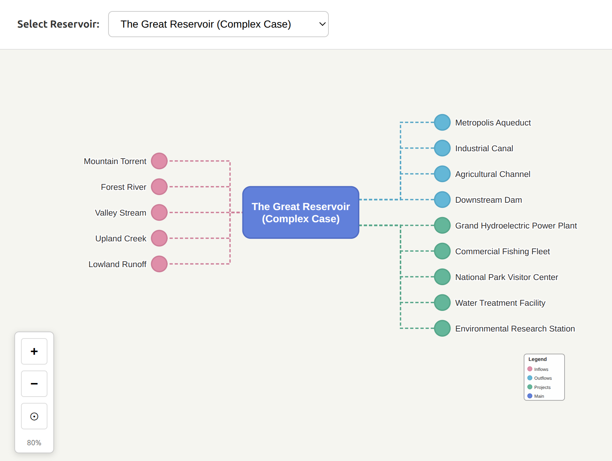

# Reservoir Pedigree Visualizer

This project is a React and D3.js application for visualizing a reservoir's network.

## Running the Project

1.  **Install Dependencies**:

    ```bash
    npm install
    ```

2.  **Run the Development Server**:

    ```bash
    npm run dev
    ```

This will start the application, and you can view it in your browser at the URL provided by Vite (usually `http://localhost:5173`).

## Screen Shot


